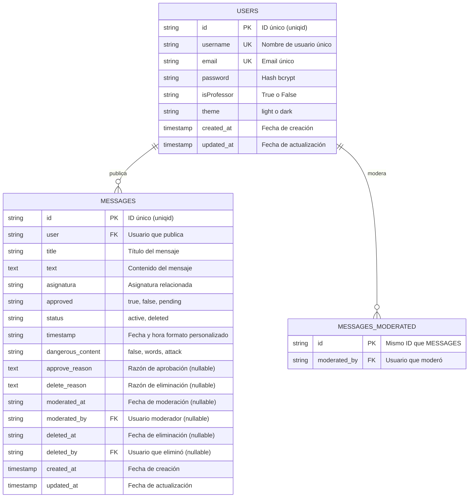
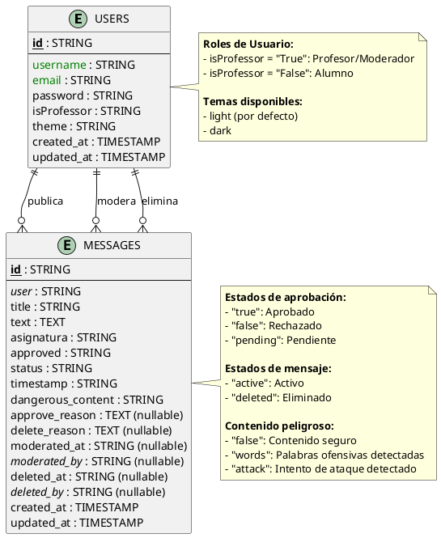

# Diagrama Entidad-Relación - NosaNet SQLite Database

## Diagrama en Formato Mermaid



## Diagrama en Formato PlantUML



## Diagrama en Formato Chen (Texto)

```
┌─────────────────────────────────────────────────────────┐
│                        USERS                            │
├─────────────────────────────────────────────────────────┤
│ PK: id (STRING)                                         │
│ UK: username (STRING)                                   │
│ UK: email (STRING)                                      │
│     password (STRING - bcrypt hash)                     │
│     isProfessor (STRING - "True"/"False")               │
│     theme (STRING - "light"/"dark")                     │
│     created_at (TIMESTAMP)                              │
│     updated_at (TIMESTAMP)                              │
└─────────────────────────────────────────────────────────┘
                   │
                   │ 1
                   │
                   │ publica
                   │
                   │ N
                   ▼
┌─────────────────────────────────────────────────────────┐
│                      MESSAGES                           │
├─────────────────────────────────────────────────────────┤
│ PK: id (STRING)                                         │
│ FK: user (STRING) → USERS.username                      │
│     title (STRING)                                      │
│     text (TEXT)                                         │
│     asignatura (STRING)                                 │
│     approved (STRING - "true"/"false"/"pending")        │
│     status (STRING - "active"/"deleted")                │
│     timestamp (STRING - "HH:mm dd/mm/yyyy")             │
│     dangerous_content (STRING - "false"/"words"/"attack"│
│     approve_reason (TEXT - nullable)                    │
│     delete_reason (TEXT - nullable)                     │
│     moderated_at (STRING - nullable)                    │
│ FK: moderated_by (STRING - nullable) → USERS.username   │
│     deleted_at (STRING - nullable)                      │
│ FK: deleted_by (STRING - nullable) → USERS.username     │
│     created_at (TIMESTAMP)                              │
│     updated_at (TIMESTAMP)                              │
└─────────────────────────────────────────────────────────┘
                   ▲
                   │ N
                   │
                   │ modera/elimina
                   │
                   │ 1
                   │
┌─────────────────────────────────────────────────────────┐
│              USERS (como Moderador)                     │
│              isProfessor = "True"                       │
└─────────────────────────────────────────────────────────┘
```

## Relaciones Detalladas

### 1. USERS → MESSAGES (Publicación)
- **Cardinalidad:** 1:N (Un usuario puede publicar muchos mensajes)
- **Tipo:** Obligatoria
- **Clave Foránea:** `messages.user` → `users.username`
- **Descripción:** Todo mensaje debe tener un usuario autor

### 2. USERS → MESSAGES (Moderación)
- **Cardinalidad:** 1:N (Un moderador puede moderar muchos mensajes)
- **Tipo:** Opcional
- **Clave Foránea:** `messages.moderated_by` → `users.username`
- **Descripción:** Solo usuarios con `isProfessor = "True"` pueden moderar
- **Condición:** Solo aplica cuando `approved = "true"` y `moderated_by IS NOT NULL`

### 3. USERS → MESSAGES (Eliminación)
- **Cardinalidad:** 1:N (Un moderador puede eliminar muchos mensajes)
- **Tipo:** Opcional
- **Clave Foránea:** `messages.deleted_by` → `users.username`
- **Descripción:** Solo usuarios con `isProfessor = "True"` pueden eliminar
- **Condición:** Solo aplica cuando `status = "deleted"` y `deleted_by IS NOT NULL`

## Restricciones y Reglas de Negocio

### USERS
1. `username` debe ser único
2. `email` debe ser único
3. `password` debe estar hasheado con bcrypt
4. `isProfessor` solo puede ser "True" o "False"
5. `theme` solo puede ser "light" o "dark"

### MESSAGES
1. `user` debe corresponder a un username existente en USERS
2. `approved` solo puede ser "true", "false" o "pending"
3. `status` solo puede ser "active" o "deleted"
4. `dangerous_content` solo puede ser "false", "words" o "attack"
5. Si `isProfessor = "True"`, el mensaje se aprueba automáticamente (`approved = "true"`)
6. Si `isProfessor = "False"`, el mensaje requiere moderación (`approved = "pending"`)
7. `moderated_by` solo puede ser un usuario con `isProfessor = "True"`
8. `deleted_by` solo puede ser un usuario con `isProfessor = "True"`
9. Si `status = "deleted"`, entonces `deleted_by` y `deleted_at` no pueden ser NULL
10. Si `approved = "true"` y fue moderado, entonces `moderated_by` y `moderated_at` no pueden ser NULL

## Índices Recomendados

```sql
-- Índices en USERS
CREATE UNIQUE INDEX idx_users_username ON users(username);
CREATE UNIQUE INDEX idx_users_email ON users(email);
CREATE INDEX idx_users_isProfessor ON users(isProfessor);

-- Índices en MESSAGES
CREATE INDEX idx_messages_user ON messages(user);
CREATE INDEX idx_messages_approved ON messages(approved);
CREATE INDEX idx_messages_status ON messages(status);
CREATE INDEX idx_messages_moderated_by ON messages(moderated_by);
CREATE INDEX idx_messages_deleted_by ON messages(deleted_by);
CREATE INDEX idx_messages_approved_status ON messages(approved, status);
```

## Consultas Comunes

### Obtener mensajes aprobados y activos
```sql
SELECT * FROM messages
WHERE approved = 'true' AND status = 'active'
ORDER BY timestamp DESC;
```

### Obtener mensajes pendientes de moderación
```sql
SELECT m.*, u.email as user_email
FROM messages m
JOIN users u ON m.user = u.username
WHERE m.approved = 'pending' AND m.status = 'active'
ORDER BY m.timestamp DESC;
```

### Obtener mensajes de un usuario específico
```sql
SELECT * FROM messages
WHERE user = 'nombre_usuario'
ORDER BY timestamp DESC;
```

### Obtener usuarios moderadores
```sql
SELECT * FROM users
WHERE isProfessor = 'True';
```

### Obtener mensajes con contenido peligroso pendientes
```sql
SELECT m.*, u.email
FROM messages m
JOIN users u ON m.user = u.username
WHERE m.dangerous_content IN ('words', 'attack')
  AND m.approved = 'pending'
  AND m.status = 'active';
```

## Visualización Online

Puedes visualizar estos diagramas en:

1. **Mermaid Live Editor:** https://mermaid.live/
   - Copia el código entre los bloques ```mermaid```

2. **PlantUML Online:** http://www.plantuml.com/plantuml/uml/
   - Copia el código entre los bloques ```plantuml```

3. **GitHub/GitLab:**
   - Ambas plataformas renderizan automáticamente diagramas Mermaid en archivos .md

4. **VS Code Extensions:**
   - Mermaid Preview
   - PlantUML Extension

## Notas Adicionales

- Las claves primarias (`id`) usan `uniqid()` de PHP, que genera IDs únicos basados en el timestamp
- Las claves foráneas no están definidas formalmente en SQLite para mantener flexibilidad
- Los timestamps usan el formato de Laravel (YYYY-MM-DD HH:mm:ss)
- El campo `timestamp` en MESSAGES usa un formato personalizado (HH:mm dd/mm/yyyy)
- SQLite no tiene tipos de datos estrictos, pero se especifican para claridad
